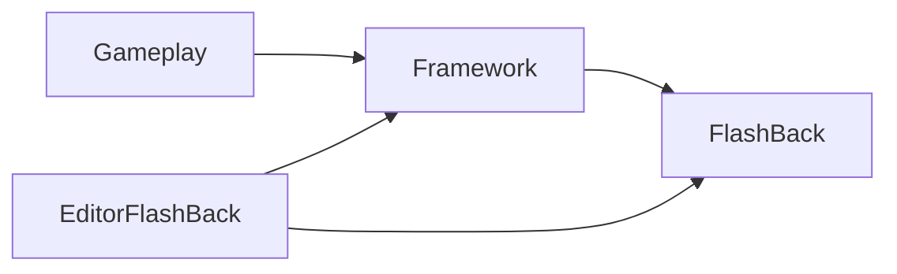

# FlashBack Architecture Overview

## Purpose

This handbook exists to preserve the design of `FlashBack` as product knowledge, not just project memory. It should stay useful even if:

- the current Unity project changes heavily,
- the SDK is extracted into a reusable package,
- or the engine changes in the future.

## Layer model

FlashBack is organized around three layers plus editor tooling:

- `FlashBack`
  - Reusable runtime building blocks that should survive project swaps.
  - Current home: `Assets/Scripts/FlashBack`
- `Framework`
  - Project-specific composition, shared conventions, config glue, and reusable-with-adaptation systems.
  - Current home: `Assets/Scripts/Framework`
- `Gameplay`
  - Game rules, content logic, feature flows, and concrete implementations.
  - Intended home: `Assets/Scripts/Gameplay`
- `Editor/FlashBack`
  - Editor-side tooling, inspectors, graph tools, and asset authoring utilities.
  - Current homes: `Assets/Editor/FlashBack`, `Assets/Editor`, and editor folders under `Assets/Scripts/Framework/Tools`

## Current architecture in one page

- The game boots through `FBMainGame`, which acts as the host and lifetime owner for all systems.
- `SystemConfig` is a partial part of `FBMainGame`; it declares system fields and composes the concrete system list.
- `FBGameSystem` provides a shared lifecycle for managers and systems.
- `FlashBack` contains the most reusable primitives today: object management, UI management, event dispatch, resource loading, timers, and support attributes.
- `Framework` contains the composition root plus systems that are reusable only with project-specific assumptions, such as level flow, networking, performance tooling, config catalogs, and code generators.
- `Gameplay` contains feature logic such as battle, buffs, units, map flow, dialogue flow, and protocol handlers.

## Product mindset

When adding or refactoring code, treat each new module as one of these:

- `Portable`
  - Can be reused in another game with the same public API and only data changes.
- `PortableWithAdapter`
  - Reusable, but only after extracting project assumptions behind interfaces, configs, or adapters.
- `ProjectBound`
  - Specific to this game's rules, content, or boot process.

The goal is not to force everything into `FlashBack`. The goal is to make reuse an explicit architectural decision and document the reason for each boundary.

## Evidence from older projects

Older projects show the same recurring ideas:

- a composition root that owns startup order,
- a central UI manager and base view model,
- an event bus using a `GameEvent` catalog,
- resource loading helpers,
- scene and level flow managers,
- data-driven configuration assets.

Those recurring patterns are the strongest candidates for long-term FlashBack product capital.

## Canonical references

- Composition root:
  - `Assets/Scripts/Framework/GameLoop/FBMainGame.cs`
  - `Assets/Scripts/Framework/Contents/Configs/SystemConfig.cs`
- Reusable runtime core:
  - `Assets/Scripts/FlashBack`
- Project framework:
  - `Assets/Scripts/Framework`
- Gameplay:
  - `Assets/Scripts/Gameplay`
- Editor tooling:
  - `Assets/Editor/FlashBack`
  - `Assets/Editor`
  - `Assets/Scripts/Framework/Tools`

