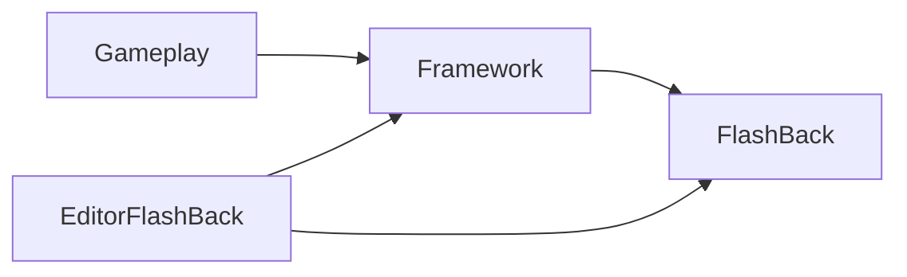

# Dependency Rules

## Allowed dependency direction

The intended dependency direction is:

## Rules

1. `FlashBack` must not depend on `Framework` or `Gameplay`.
2. `Framework` may depend on `FlashBack`, but should not require concrete gameplay features to exist.
3. `Gameplay` may depend on both `Framework` and `FlashBack`, but should prefer entering through framework-level composition points.
4. Editor code may depend on runtime code, but runtime code must not require `UnityEditor`.
5. New reusable modules must be documented before they are treated as shared product capital.

## What belongs where

### FlashBack

Keep code here when it is:

- generic across games,
- not tied to a specific content model,
- not hardcoded to project assets,
- and usable without importing current gameplay systems.

Examples:

- `Assets/Scripts/FlashBack/EventSystem/FBEventSystem.cs`
- `Assets/Scripts/FlashBack/Time/FBTimerSystem.cs`
- `Assets/Scripts/FlashBack/ResourceSystem/FBResourceManager.cs`

### Framework

Keep code here when it:

- composes reusable modules into this project's architecture,
- defines shared config catalogs or conventions,
- depends on the current project boot process,
- or is reusable only after adaptation.

Examples:

- `Assets/Scripts/Framework/GameLoop/FBMainGame.cs`
- `Assets/Scripts/Framework/Contents/Configs/SystemConfig.cs`
- `Assets/Scripts/Framework/LevelSystem/FBLevelSystem.cs`
- `Assets/Scripts/Framework/NetworkSystem/NetworkManager.cs`

### Gameplay

Keep code here when it:

- expresses rules, content, unit behavior, battle logic, feature flow, or map/dialogue logic,
- or names concrete game concepts.

Examples:

- `Assets/Scripts/Gameplay/BattleSystem/FBBattleSystem.cs`
- `Assets/Scripts/Gameplay/BuffSystem/FBBuffSystem.cs`
- `Assets/Scripts/Gameplay/Systems/DialogueSystem/UI_Dialogue.cs`

## Current violations and risks

- `FBEventSystem` depends on `GameEvent.Event`, which is currently defined under framework config rather than a neutral contract layer.
- `FBUIManager` reaches into `FBMainGame.System`, `UIConfig`, and `FBUICreator`, which makes a nominally reusable UI manager rely on project composition and tool-generated metadata.
- `FBLevelSystem` is thin but still directly calls `FBMainGame.System` and framework-level events.
- `FBNetworkManager` depends on `FBMainGame.System`, `UnityMainThreadDispatcher`, reflection-driven handlers, and resource paths under `Resources/NetworkProtocols`.
- Performance tooling mixes runtime assets and editor-facing types.

## Practical coding guidance

Before adding a new type, answer these questions:

1. Would this still make sense in another game with different art, scenes, and rules?
2. Does it require `FBMainGame.System` to function?
3. Does it require current enums, config catalogs, or hardcoded resource paths?
4. Does it rely on editor-only APIs?

Classification rule:

- If the answer is "no" to 2, 3, and 4, it is a strong `FlashBack` candidate.
- If it depends on project composition but could be separated later, keep it in `Framework`.
- If it names the game's rules or content, keep it in `Gameplay`.

## Future hardening targets

- Introduce namespaces by layer.
- Separate runtime/editor APIs more cleanly.
- Move cross-project contracts away from project-bound config types.
- Replace direct global access with explicit composition points where it improves portability.

